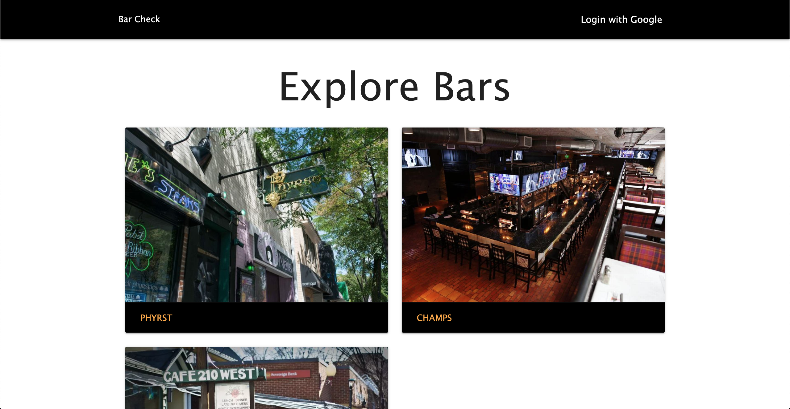

# Bar Check
## Description
#### Bar Check is a posting board for bars located across the US. Logged in users can add posts about their favorite bar including a description and pictures. Once created, users can then create their favorite drinks from that bar and add it so that others can see.

## Getting Started
#### App Link - https://shielded-headland-35506.herokuapp.com/bars
#### 1) User will see a list of posts about various bars
#### 2) User can click on any of the posts to see a detailed view of that bar
#### 3) User can log in and add their own post about their favorite bar
#### 4) User can create drinks and add them to their bar

## App Homepage

## Technologies Used
#### - NodeJS
#### - ExpressJS
#### - MongooseJS
#### - MongoDB
#### - Atlas
#### - Materialize

## Future Goals
#### - Lock bar editing/deleting behind user who posted
#### - Allow users to leave comments / reviews
#### - Allow users to "like" bars and drinks

## Initial WireFrame

